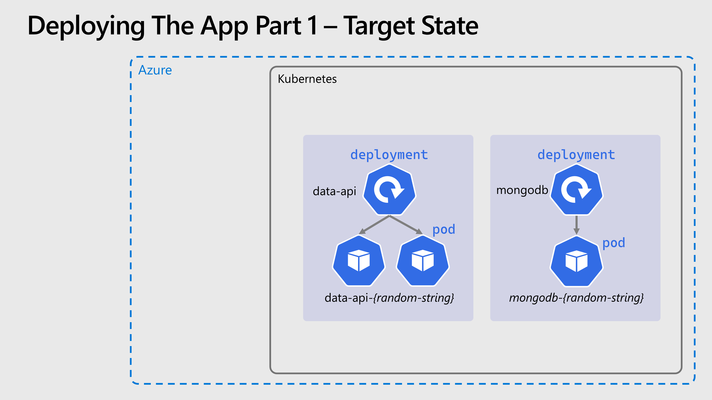

# 🚀 Creating a Real Deployment
Pods are both ephemeral and "mortal", they should be considered effectively transient.
Kubernetes can terminate and reschedule pods for a whole range of reasons, including rolling updates, hitting resource limits, scaling up & down and other cluster operations. In order to manage these pods, we need a higher-level abstraction: Deployments.

## 🗃️ Deploying the Server

Next we'll deploy the first custom part of our app, the data API, and we'll deploy it from an image hosted in our private registry.

- The image needs to be `{ACR_NAME}.azurecr.io/smilr/data-api:stable` where `{ACR_NAME}` should be
  replaced in the YAML with your real value, i.e. the name of your ACR resource.
- Set the number of replicas to **2**.
- The port exposed from the container should be **4000**.
- An environmental variable called `MONGO_CONNSTR` should be passed to the container, with the connection string to connect to the MongoDB, which will be `mongodb://admin:supersecret@{MONGODB_POD_IP}` where `{MONGODB_POD_IP}` should be replaced in the YAML with the pod IP address you just queried.
- Label the pods with `app: data-api`.

Again you can try building the _Deployment_ yourself or use the provided YAML to create a `data-api-deployment.yaml` file

<details markdown="1">
<summary>Click here for the DataAPI deployment YAML</summary>

```yaml
kind: Deployment
apiVersion: apps/v1

metadata:
  name: data-api

spec:
  replicas: 2
  selector:
    matchLabels:
      app: data-api
  template:
    metadata:
      labels:
        app: data-api
    spec:
      containers:
        - name: data-api-container

          image: {ACR_NAME}.azurecr.io/smilr/data-api:stable
          imagePullPolicy: Always

          ports:
            - containerPort: 4000

          env:
            - name: MONGO_CONNSTR
              value: mongodb://admin:supersecret@{MONGODB_POD_IP}
```

</details>
</br>

**💥 Notice:** We have the password in plain text within the connection string! This clearly is a very bad practice, we will fix this at a later stage when we introduce Kubernetes _Secrets_.

Make the changes described above, **remember to make the edits, you can not use this YAML as is**,
and then run:

```bash
kubectl apply -f data-api-deployment.yaml
```

Check the status as before with `kubectl` and it's worth checking the logs with `kubectl logs {podname}` to see the output from the app as it starts up.

This time we've set the number of replicas to two, if you run `kubectl get pods -o wide` you will see which _Nodes_ the _Pods_ have been scheduled (assigned) to.
You should see each _Pod_ has been scheduled to different _Nodes_, but this is not guaranteed. _Pod_ scheduling and placement is a fairly complex topic, for now we can move on.

## ⏩ Accessing the Data API (The quick & dirty way)

Now it would be nice to access and call this API, to check it's working. But the IP address of the
_Pods_ are private and only accessible from within the cluster. In the next section we'll fix that,
but for now there's a short-cut we can use.

Kubernetes provides a way to "tunnel" network traffic into the cluster through the control plane,
this is done with the `kubectl port-forward` command.

Pick the name of either one of the two `data-api` _Pods_, and run:

```bash
kubectl port-forward {pod_name} 4000:4000
```

And then accessing the following URL [http://localhost:4000/api/info](http://localhost:4000/api/info) either in your browser or with `curl` we should see a JSON response with some status and debug
information from the API.

```sh
curl http://localhost:4000/api/info | json_pp
```

Clearly this isn't a good way to expose your apps long term, but can be extremely useful when debugging and triaging issues.

When done, cancel the port-forwarding with `ctrl-c`

## 🖼️ Cluster & Architecture Diagram

The resources deployed into the cluster & in Azure at this stage can be visualized as follows:



## Navigation

[Return to Main Index 🏠](../readme.md) ‖
[Previous Section ⏪](../03-the-application/readme.md) ‖ [Next Section ⏩](../05-network-basics/readme.md)
